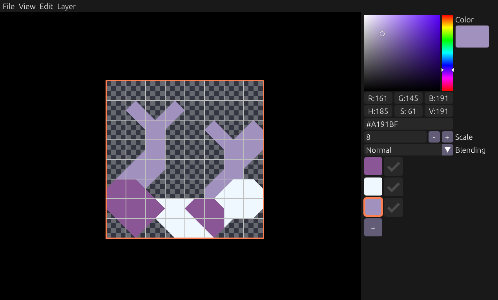

# Lamina

A simple grid-based editor for making vector-styled images. Used for Mindustry sector icons.

## Downloads

Download `lamina-win64.exe` at the [Releases](https://github.com/Anuken/Lamina/releases) page. Only Windows builds are provided. 

## Hotkeys

- `Left Mouse`: paint
- `Right Mouse`: erase
- `Space`: new layer
- `Ctrl+Up/Down`: shift layer in list
- `Up/Down`: select layer above/below
- `R+Left-Click`: select layer based on cursor
- `Del`: delete layer
- `Shift+Arrow Keys`: move layer contents
- `1-9`: jump to layer
- `Ctrl+Z`: undo
- `Ctrl+Shift+Z`: redo

## Compiling (Linux/Mac only)

1. Install the latest stable version of Nim. `~/.nimble/bin` must be on your PATH.
2. Make sure this repository was cloned with `--recursive`, as it uses git submodules
3. If on Linux, `sudo apt install -y xorg-dev libgl1-mesa-dev` or equivalent packages
4. `cd fau && nimble install -y && cd ..`
5. `nimble debug` to run